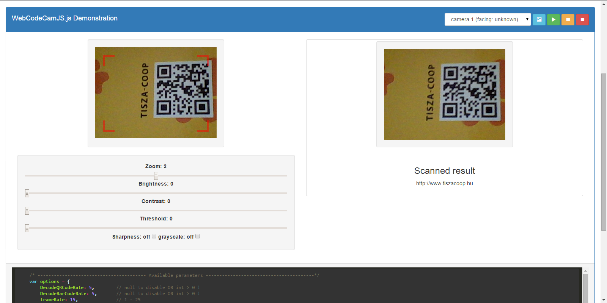

WebCodeCamJS 
=============

Native javascript version of popular WebCodeCam jQuery plugin
Advantages compared to the previous version:
Faster, Lower CPU and Memory usage and more conigurable!

    - Very simple usage
    - Some option for optimal result
    - Quick implementation


* [WebCodeCamJS] - Online Demo 



Version
----

1.0.0


Included decoders
-----------

barcode decoder ([DecoderWorker.js])

qr-decoder ([qrcodelib.js])
 

Required HTML & Javascript example
--------------

```sh
<script>
/* ---------------------------------------- Available parameters ----------------------------------------*/
    var options = {
        DecodeQRCodeRate: 5,        // null to disable OR int > 0 !
        DecodeBarCodeRate: 5,       // null to disable OR int > 0 !
        frameRate: 15,              // 1 - 25
        width: 320,                 // canvas width
        height: 240,                // canvas height
        videoSource: {
            id: true,               // default Videosource             
            maxWidth: 640,          // max Videosource resolution width
            maxHeight: 480          // max Videosource resolution height
        },
        flipVertical: false,        // boolean
        flipHorizontal: false,      // boolean
        zoom: -1,                   // if zoom = -1, auto zoom for optimal resolution else int
        beep: "js/beep.mp3",        // string, audio file location
        brightness: 0,              // int
        autoBrightnessValue: false, // functional when value autoBrightnessValue is int
        grayScale: false,           // boolean
        contrast: 0,                // int
        threshold: 0,               // int 
        sharpness: [],              // to On matrix, example for sharpness ->  [0, -1, 0, -1, 5, -1, 0, -1, 0]
        resultFunction: function(resText, lastImageSrc) {
            /* resText as decoded code, lastImageSrc as image source
            example:
            alert(resText);
            */
        },
        getUserMediaError: function() {
            /* callback funtion to getUserMediaError
            example:
            alert('Sorry, the browser you are using doesn\'t support getUserMedia');
            */
        },
        cameraError: function(error) {
            /* callback funtion to cameraError, 
            example:
            var p, message = 'Error detected with the following parameters:\n';
            for (p in error) {
                    message += p + ': ' + error[p] + '\n';
            }
            alert(message);
            */
        }
    };

    /*------------------------------------ Declarations and initializing ------------------------------------*/
    var canvas = document.querySelector('#webcodecam-canvas');
    new WebCodeCamJS(canvas).init(args);
    /* Example initializations */
    var decoder = new WebCodeCamJS('#webcodecam-canvas');
    /* Chrome: build select menu, return decoder object
    *  Firefox: the default camera initializes, return decoder object 
    */
    decoder.buildSelectMenu('select');
    //init with arguments, return decoder object
    decoder.init(args);
    /*OR with defaults*/
    var decoder = new WebCodeCamJS('#webcodecam-canvas').init();
    /*OR with arguments*/
    var decoder = new WebCodeCamJS('#webcodecam-canvas').init(args);
    /*OR with video source selector builder and initialization*/
    var decoder = new WebCodeCamJS('#webcodecam-canvas').buildSelectMenu('select').init(args);

    /* ---------------------------------------- Available Functions: ----------------------------------------*/
    /* camera stop, but don't delete stream(s) */
    decoder.cameraStop();
    /* camera stop , and delete stream(s) */
    decoder.cameraStopAll();
    /* camera show, restore process */
    decoder.cameraPlay();
    /* get current image from camera */
    decoder.getLastImageSrc();
    /* Configurable options */
    decoder.options['parameter'];
    /* Example: 
    ** decoder.options.brightness = 20;         - set brightness to 20
    ** decoder.options.DecodeQRCodeRate = null; - disable qrcode decoder
    */
</script>
```

License
----

MIT

Author: Tóth András
---
http://atandrastoth.co.uk/

2015-06-10

[WebCodeCamJS]:http://atandrastoth.co.uk/main/pages/plugins/webcodecamjs/
[DecoderWorker.js]:https://github.com/EddieLa/BarcodeReader
[qrcodelib.js]:https://github.com/LazarSoft/jsqrcode
